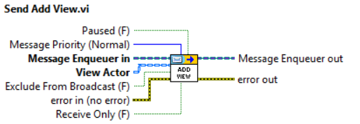

# MVC Actors
A library that extends the Actor Framework to allow for Model View Controller (MVC) patterns based on an Event Publisher/Subscriber mechanism.

This library allows the implementation of MVC patterns within the Actor Framework. Controller Actors define View Actors and Events; View Actors can subscribe to a subset of such events. Events can be fired either by the Controller Actors to all the View Actors and handled by them by suitable Even Handlers defined upon subscription or by View Actors to the Controller Actor, in the latter case the Controller Actor will handle them by means of suitable Event Handlers defined upon definition of the Events and will in turn broadcast the event to all the View actors but the one from which the Event originated. 

The library further provides children of the View Actor that provide tools to allow for the GUI Management of the Front Panels of the Actor Cores of suitable concrete implementations. The **"GUI View Actor"** is a subclass of the View Actor that provides the functionality to manage the Front Panel (Opening, Closing, Activation, Minimization, Maximization, Hiding, etc.) of all the **“Actor Core.vi”**s of the whole actor class hierarchy. The **"GUI Container Actor"** is a subclass of the **"GUI View Actor"** that provides the infrastructure for the management of Subpanels present in their **“Actor Core.vi”** allowing inserting and removing the Front Panel of the **“Actor Core.vi”** s of the whole actor class hierarchy defined by any subclass of the **"GUI View Actor"**.

## Quick Start Guide
* **Create the controller**: Create the controller by subclassing the **"Controller Actor.lvclass"** class.
* **Define Events**: Override the **"Define Events.vi"** Controller Actor method. Therein define events by calling the method **"Add Event.vi"**. Events are subclasses of the **Event.lvclass** class. Events for the main LabVIEW types exist already. Before wiring the events to the **"Define Events.vi"** method set the event names by means of the suitable **Event.lvclass** method. 

* **Define controller event handlers**: In case you want the controller to handle an event fired by a view create an event handler by subclassing **"Abstract Event Handler for Controller.lvclass"**. Then override the **"Handle Event.vi"** method and therein you will extract data from the event and call a suitable handler method of the controller. Once created wire it to the **"Add Event.vi"** call in the previous step.

* **Create a view**: Create a view by subclassing the **"View Actor.lvclass"**
* **Register events**: Override the **"Register Events to Controller.vi"** View Actor method. Therein register to the events defined by the controller by calling the **"Register Event.vi"** method by wiring the event classes you want to register to. Set the neames of events just as you did for the controller.

* **Define view event handlers**: In case you want the view to handle an event broadcast from another view or fired by the controller create an event handler by subclassing **"Abstract Event Message for View.lvclass"**. Then override the **"Do.vi"** method and therein you will extract data from the event and call a suitable handler method of the controller. Once created wire it to the **"Register Event.vi"** call in the previous step.

* **Initialize the created view in the controller**: Override the **"Initialize Views.vi"** Controller Actor method. Therein initialize the defined views by calling the **"Add View.vi"** Controller Actor method after having set a view name

You will now be ready to implement your controller logic, the model that will interact the controller and the view logic. To generate and broadcast an event form the view execute the **"Generate and Broadcast Event.vi"** method, to generate and event form the controller execute the **"Generate Controller Event.vi"** method.

### GUI Views
To implement GUI Views you have to perform the same steps as for normal views, however now you will have to subclass either the **"GUI View Actor.lvclass"** or the **"GUI Container Actor"** depending on your needs. For the **"GUI Container Actor"** perform the following additional steps

* Override the "Actor Core.vi"
* In its Front Panel create the subpanels you want to act as containers
* Store the subpanel references by calling the **Store Subpanel References.vi** method

**Optional:**
* Register to the **Views User Events Refs** and **Exit Loop User Event Ref** user defined events provided by the **"GUI Container Actor**. The former allows you receive an array of strings containing the names of the views currently active, the latter is a user event fired when the the method **"Exit Event Loop.vi"** is executed and is a convenience infrastructure useful when creating an event structures within the **"Actor COre.vi"**
* Exit the event loop mentioned above by calling the **"Exit Event Loop.vi"** method.

## Example Code
The library comes with an example that illustrates the full API. Within the source tree the examples can be found at the path `./MVC Actors Examples`. When installing the VIPM package you will find the example at the path `(LabVIEW Root Path)/examples/LS Instruments AG/MVC Actors/MVC Actors Examples`

# Methods and Classes documentation

## The "Controller Actor.lvclass"  Class
A child of the "Controller Actor.lvclass" defines a set of events (by overloading the "Define Events.vi" method and therein calling the "Add Event.vi" method for each Event to be defined) and Views (by overloading the "Initialize Views.vi" Method). Events, fired by the Controller and handled by Views, carry data and are defined subclassing the "Event Class.lvclass". Events can be also fired by Views and handled by Controllers, indeed for each event, the controller can optionally define a handler by subclassing the "Abstract Event Handler For Controller Msg.lvclass" message and implementing the "Handle Event.vi" and wire it to the Handler to the "Add Event.vi". This will allow the controller to take action upon an event fired by a View. Depending on how the events are fired they can be either targeted to all defined "Views Actors" or just a specific  "Views Actor".

### The "Define Events.vi" method

This dynamic dispatch VI has to be overriden by the concrete Controller Actor subclasses in order to define the event served by the Controller Actor.

### The "Add Event.vi" methods

This method adds an event to the list of the events handled by the Controller Actor. If the Controller Actor wants to handle the events form the View, a **"Controller Event Fire Handler"** should be wired.

### The "Initilaize Views.vi" method

This dynamic dispatch VI has to be overridden by the concrete Controller Actor subclasses in order to initialize the View Actors that are going to register for events.

### The "Add View.vi"/"Send Add View.vi" methods

*Execute the **"Add View.vi"** version from other Controller methods, specifically form the **"Initilaize Views.vi" method**. If you want to initialize views in any other manner, e.g. form an **"Actror Core.vi"** method then use **"Send Add View.vi"***

Starts a View Actor with following settings:

**Exclude From Broadcast**: message originating form another view will not be broadcasted to the view being cosidered
**Paused**: the view will not send events and will not receive them anymore
**Receive only**: The view will receive events but not send any

### The "Remove View.vi"/"Send Remove View.vi" methods

*Execute the **"Remove View.vi"** version from other Controller methods. If you want to remove views in any other manner, e.g. form an **"Actror Core.vi"** method then use **"Send Remove View.vi"***

Stops and removes a View actor as specified by his name. Can remove all the Views if the **"Remove All (F)"** is set to true

### The "Generate Event to View.vi" method

This method generates/fires the Event wired to the input. Firing an event looks up all actors who Registered to listen to this Event and sends to them this Event on a Zero Coupling based message defined during Registration. Errors on broadcasting the event i.e. enqueuer of the registrant not existing, are ignored.

**IMPORTANT** - Only call this method within actor core of your Controller Actor. From helper loops call the Send Generate Event message to self. This is to make sure your actor works with all registered listeners.

### The "Send Read View Settings.vi" method

Allows  the child controller to get the behavior of a View actor specified in the **View Name** by registering to the user defined event whose reference is accessible by the **View Settings Event Ref** property that will deliver the following settings:

**Exclude From Broadcast**: message originating form another View will not be broadcast to the View being considered
**Paused**: the View will not send events and will not receive them anymore
**Receive only**: The View will receive events but not send any

### The "Send Write View Settings.vi" method

Allows to set the View behavior by setting the following flags:

**Exclude From Broadcast**: message originating form another View will not be broadcast to the View being considered
**Paused**: the View will not send events and will not receive them anymore
**Receive only**: The View will receive events but not send any

### The "Finalize View Init.vi" method

Override this method to finalize Views' initialization by generating Controller events to the View specified in the "View Name" input terminal. To this end you can call the method **"Generate Event to View.vi"**. A typical use case is that of generating Controller events to update the Views upon init about the current state of the Controller.

### The "Generate Event to View.vi" method

Generates the event **Event** to the View Actor with name **View Name**. This is typically used in the overridden method "Finalize View Init.vi"  to init a specific View Actor upon its launch.

