# MVC Actors
A library that extends the "Send Generate View Event.vi" to allow for **Model View Controller (MVC)** patterns based on a bidirectional event publisher/subscriber mechanism.

This library allows the implementation of MVC patterns within the Actor Framework. **Controller Actors** define **View Actors** and **Events**; View Actors can subscribe to a subset of such events. Events can be fired either by the Controller Actors to all the View Actors and handled by them by suitable **Event Handlers** defined upon subscription or by View Actors to the Controller Actor, in the latter case the Controller Actor will handle them by means of suitable **Event Handlers** defined upon definition of the Events and will in turn broadcast the event to all the View actors but the one from which the Event originated. 

The library further provides children of the **View Actor** that implement tools to allow for the GUI Management of the Front Panels of the Actor Cores of suitable concrete implementations. The **GUI View Actor** is a subclass of the **View Actor** that provides the functionality to manage the Front Panel (Opening, Closing, Activation, Minimization, Maximization, Hiding, etc.) of all the **Actor Core.vi** of the whole actor class hierarchy. The **GUI Container Actor** is a subclass of the **GUI View Actor** that provides the infrastructure for the management of Subpanels present in its **Actor Core.vi** allowing inserting and removing the Front Panel of the **Actor Core.vi** of the whole actor class hierarchy defined by any subclass of the **GUI View Actor**.

# Quick Start Guide
* **Create the controller**: Create the controller by subclassing the **"Controller Actor.lvclass"** class.
* **Define Events**: Override the **"Define Events.vi"** Controller Actor method. Therein define events by calling the method **"Add Event.vi"**. Events are subclasses of the **Event.lvclass** class. Events for the main LabVIEW types exist already. Before wiring the events to the **"Define Events.vi"** method set the event names by means of the suitable **Event.lvclass** method. 

* **Define controller event handlers**: In case you want the controller to handle an event fired by a view create an event handler by subclassing **"Abstract Event Handler for Controller.lvclass"**. Then override the **"Handle Event.vi"** method and therein you will extract data from the event and call a suitable handler method of the controller. Once created wire it to the **"Add Event.vi"** call in the previous step.

* **Create a view**: Create a view by subclassing the **"View Actor.lvclass"**
* **Register events**: Override the **"Register Events to Controller.vi"** View Actor method. Therein register to the events defined by the controller by calling the **"Register Event.vi"** method by wiring the event classes you want to register to. Set the neames of events just as you did for the controller.

* **Define view event handlers**: In case you want the view to handle an event broadcast from another view or fired by the controller create an event handler by subclassing **"Abstract Event Message for View.lvclass"**. Then override the **"Do.vi"** method and therein you will extract data from the event and call a suitable handler method of the controller. Once created wire it to the **"Register Event.vi"** call in the previous step.

* **Initialize the created view in the controller**: Override the **"Initialize Views.vi"** Controller Actor method. Therein initialize the defined views by calling the **"Add View.vi"** Controller Actor method after having set a view name

You will now be ready to implement your controller logic, the model that will interact the controller and the view logic. To generate and broadcast an event from the view execute the **"Generate and Broadcast Event.vi"/"Send Generate and Broadcast Event.vi"** methods, to generate and event from the controller execute the **"Generate Controller Event.vi"/"Send Generate Controller Event.vi"** methods.

## GUI Views
To implement GUI Views you have to perform the same steps as for normal views, however now you will have to subclass either the **"GUI View Actor.lvclass"** or the **"GUI Container Actor"** depending on your needs. For the **"GUI Container Actor"** perform the following additional steps

* Override the "Actor Core.vi"
* In its Front Panel create the subpanels you want to act as containers
* Store the subpanel references by calling the **Store Subpanel References.vi** method

**Optional:**
* Call the **"Register to Container Events.vi"** method to register to the **Views User Events Refs** and **Exit Loop User Event Ref** user defined events provided by the **"GUI Container Actor**. The former allows you receive an array of strings containing the names of the views currently active, the latter is a user event fired when the the method **"Exit Event Loop.vi"** is executed and is a convenience infrastructure useful when creating an event structures within the **"Actor Core.vi"**

* Exit the event loop mentioned above by calling the **"Exit Event Loop.vi"** method.

# Example Code
The library comes with an example that illustrates the full API. Within the source tree the examples can be found at the path `./MVC Actors Examples`. When installing the VIPM package you will find the example at the path `(LabVIEW Root Path)/examples/LS Instruments AG/MVC Actors/MVC Actors Examples`

# Methods and Classes Documentation

## The "Controller Actor.lvclass"  Class
A child of the "Controller Actor.lvclass" defines a set of events (by overloading the "Define Events.vi" method and therein calling the "Add Event.vi" method for each Event to be defined) and Views (by overloading the "Initialize Views.vi" Method). Events, fired by the Controller and handled by Views, carry data and are defined subclassing the "Event Class.lvclass". Events can be also fired by Views and handled by Controllers, indeed for each event, the controller can optionally define a handler by subclassing the "Abstract Event Handler For Controller Msg.lvclass" message and implementing the "Handle Event.vi" and wire it to the Handler to the "Add Event.vi". This will allow the controller to take action upon an event fired by a View. Depending on how the events are fired they can be either targeted to all defined "Views Actors" or just a specific  "Views Actor".

### The "Define Events.vi" Method

This **abstract dynamic dispatch** VI has to be overridden by the concrete Controller Actor subclasses in order to define the event served by the Controller Actor. Within the concrete implementation of this abstract method the user will call the **Add Event.vi** method for each of the events to be defined. This method is automatically executed upon Controller launch, other events can be dynamically defined during the Controller execution by calling the **Add Event.vi** method.

### The "Add Event.vi"/"Send Add Event.vi" Methods

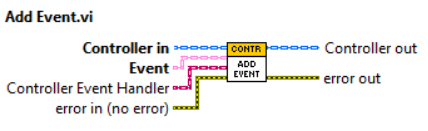
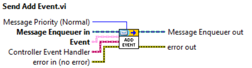

This method adds an event to the list of the events handled by the **Controller**. If the **Controller** wants to handle the events from the **View**, a concrete implementation of the **"Abstract Event Handler for Controller.lvclass"** should be wired to the **"Controller Event Handler"** terminal.

### The "Initilaize Views.vi" Method

This **abstract dynamic dispatch** VI has to be overridden by the concrete **Controller** subclasses in order to initialize the **Views** that are going to register for events. Within the concrete implementation of this abstract method the user will call the **Add View.vi** method for each of the **Views** to be initialized. This method is automatically executed upon Controller launch, other events can be dynamically defined during the Controller execution by calling the **Add View.vi** method.

### The "Add View.vi"/"Send Add View.vi" Methods

*Execute the **"Add View.vi"** version from other Controller methods, specifically from the **"Initialize Views.vi" method**. If you want to initialize views in any other manner, e.g. from an **"Actor Core.vi"** method then use **"Send Add View.vi"***

Starts a **View Actor** with following settings:

**Exclude From Broadcast**: message originating from another view will not be broadcast to the view being considered    
**Paused**: the view will not send events and will not receive them anymore  
**Receive only**: The view will receive events but not send any

### The "Remove View.vi"/"Send Remove View.vi" Methods

*Execute the **"Remove View.vi"** version from other Controller methods. If you want to remove views in any other manner, e.g. from an **"Actor Core.vi"** method then use **"Send Remove View.vi"***

Stops and removes a View actor as specified by his name. Can remove all the Views if the **"Remove All (F)"** is set to true

### The "Generate Controller Event.vi"/"Send Generate Controller Event.vi" Methods

This method generates/fires the Event wired to the input. Firing an event looks up all actors who registered to listen to this Event and sends to them this Event on a Zero Coupling based message defined during registration. Errors on broadcasting the event i.e. enqueuer of the registrant not existing, are ignored.

**IMPORTANT** - Only call this method within actor core of your Controller Actor. From helper loops call the Send Generate Event message to self. This is to make sure your actor works with all registered listeners.

### The "Send Read View Settings.vi" Method

Allows  the child controller to get the behavior of a View actor specified in the **View Name** by registering to the user defined event whose reference is accessible by the **View Settings Event Ref** property that will deliver the following settings:

**Exclude From Broadcast**: message originating from another View will not be broadcast to the View being considered  
**Paused**: the View will not send events and will not receive them anymore  
**Receive only**: The View will receive events but not send any

### The "Send Write View Settings.vi" Method

Allows to set the View behavior by setting the following flags:

**Exclude From Broadcast**: message originating from another View will not be broadcast to the View being considered  
**Paused**: the View will not send events and will not receive them anymore  
**Receive only**: The View will receive events but not send any

### The "Finalize View Init.vi" Method
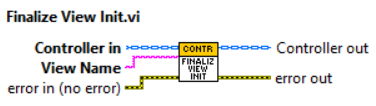

Override this method to finalize Views' initialization by generating Controller events to the View specified in the **"View Name"** input terminal. To this end you can call the method **"Generate Event to View.vi"**. A typical use case is that of generating Controller events to update the Views upon init about the current state of the Controller.

### The "Generate Event to View.vi" Method

Generates the event **Event** to the View Actor with name **View Name**. This is typically used in the overridden method "Finalize View Init.vi"  to init a specific View Actor upon its launch.

## The "View Actor.lvclass"  Class
A child of the **"View Actor.lvclass"**, the View, is inited by a certain Controller that defines a set of Events as subclasses of the **"Event.lvclass"** class. The View can subscribe to a subset, if not all, the events defined by the Controller and handle them by subclassing the **"Abstract Event Handler for View"** message and implementing its **Do.vi** method. Subscription can be performed by implementing the **"Register Events to Controller.vi"** abstract method, which is called upon the View's launch. Therein events are subscribed by calling the **"Register Event.vi"** method providing suitable Event Handlers. Defining at least one handler is mandatory.

### The "Generate and Broadcast Event.vi"/"Send Generate and Broadcast Event.vi" Methods

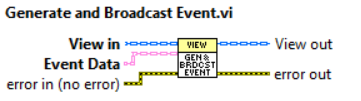
 

This method generates/fires the **Event** wired to the input. The method checks if the view is paused or "Receive Only" and then sends the **"Generate and Broadcast Event"** message to the associated controller. The controller will in turn send the **Event** to all the Views who registered to that event but the originating View.

**IMPORTANT** - Call this method directly (i.e. without sending the corresponding message) only within the View methods. From helper loops send the corresponding message to self by calling the suitable send method. This is to make sure your View works with up-to-date settings.

### The "Register Event.vi"/"Send Register Event.vi" Methods  

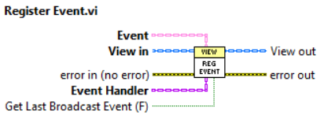
  
  
Registers an **Event** to the Controller by specifying the concrete event and the corresponding **Event Handler**. If **"Get Last Broadcast Event (F)"** is TRUE the View will receive the last broadcast **Event**.

*Execute the **"Register Event.vi"** version from other View methods. If you want to register events in any other manner, e.g. from an **"Actor Core.vi"** method then use **"Send Register Event.vi"***

### The "Unregister Event.vi"/"Send Unregister Event.vi" Methods  

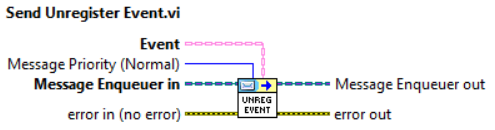  
  
Unregisters an **Event** to the Controller by specifying the concrete event.

*Execute the **"Unregister Event.vi"** version from other View methods. If you want to unregister events in any other manner, e.g. from an **"Actor Core.vi"** method then use **"Send Unregister Event.vi"***

### The "Generate View Event.vi"/"Send Generate View Event.vi" Methods  

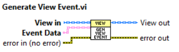
  
  
This method generates/fires the **Event** wired to the input. Firing an event checks if the view is paused or "Receive Only" . This event will not be broadcast to other Views.

*Execute the **"Generate View Event.vi"** version from other View methods. If you want to generate View events in any other manner, e.g. from an **"Actor Core.vi"** method then use **"Send Generate View Event.vi"***

## The "Abstract Event Handler for Controller.lvclass" Abstract Class
Abstract class to be subclassed each time we want the **Controller** not only to broadcast an event originating from a **View** to the other Views but also to handle it.
The abstract method to be implemented in the concrete class is **"Handle Event.vi"**.
Concrete subclasses of this class, once created, must be wired to the suitable call to **"Add Event.vi"** method in the **"Define Events.vi"** method (to be implemented) of the **Controller** in question.

### The "Handle Event" Abstract Method

Abstract method to be implemented in the concrete subclass to handle **Controller** events. Within this method the input **Event** should be cast to the expected concrete implementation and used as argument to the **Controller** method designated to handle the specific **Event**.

## The "Abstract Event Message for View.lvclass" Abstract Message
Abstract message to be subclassed each time we want the **View** to subscribe to an event, and hence handle it, defined by the **Controller** that inited the **View**. 
The abstract method to be implemented in the concrete class is **"Do.vi"** as for standard Actor abstract messages.
Concrete subclasses of this class once created must be wired to the suitable call to **"Register Event.vi"** call in the **"Register Events to Controller.vi"** method (to be implemented) of the **View** in question.

### The "Read Event Data.vi" Method

Reads the **Event** data from the concrete implementation of the **"Abstract Event Message for View.lvclass"** abstract message sent to **View**. This method should be called within the concrete **"Do.vi"** method to read the **Event** data to be used as an argument to the call of the **View**  method designated to handle the corresponding Event.

## The "Event.lvclass" Class
This class represents the data being passed while a specific event is fired. Use this class as a base for inheritance in your specific event types. When an event is fired it's sent to all registered actors listening for it. Concrete subclasses exist already for the major LabVIEW data types and for events that carry no data (**Event Void.lvclass**). If a datatype is not covered by the predefined events you can create your own concrete subclass of this class. 

**You are not supposed to use this class in your code lest some functionalities of the library will break**

### The "Get Event ID.vi" Method

Gets the unique ID of the event specific class

**Event ID**: string containing the unique identifier of the Event

### The "Set Event Name.vi" Method

Sets the name that will define the event. You can keep the input Event object unwired if you only specify the name for event. This can be used for example while unsubscribing i.e. when only the name is needed.

**IMPORTANT**:  If no name is wired or the wired string is empty, the name "Generic" will be set. This is to prevent errors with dictionary key name being empty.

### The "Get Event Name.vi" Method

Get the name that defines the event.

**IMPORTANT**: If no name is wired or the name string is empty, the name "Generic" will be used. This is to prevent errors with dictionary key name being empty.

## The "GUI View.lvclass" Class
The actor **GUI View** is a subclass of the **View** that provides basic functionality for the front panel management of the **View's** **"Actor Core.vi"** VIs. Users can open, close, and set the front panel state. Since the **GUI View** can be infinitely subclassed, users can act on each of the front panels defined in the class hierarchy.

### The "Open Front Panel.vi"/"Send Open Front Panel.vi" Methods

Opens the Front Panel of a specified **Actor Core.vi** VI of the specified **GUI View** class hierarchy. The method is active only if the GUI View is not contained.

**View Hierarchy Level**: The level on the subclassing hierarchy of the **GUI View**, it is used to choose the **Actor Core.vi** Front Panel among all the existing subclasses of the **GUI View** present in the **View** specified above.

**Activate?**: If FALSE (default), the front panel window does not open as the active window. If TRUE, the front panel window opens as the active window.

**Front Panel Window:State**: Sets the state in which to open the front panel window.

* **0	Invalid** - If you set the input to this value, the method returns an error.
* **1	Standard (default)** - Opens the front panel window but does not minimize, maximize, or hide the window.
* **2	Closed** - If you set the input to this value, the method returns an error.
* **3	Hidden** - Opens the front panel window as floating but not visible. If you set the input to this value and close all references to the front panel, the window remains open but hidden. Because the VI is open, the Getting Started window does not appear. To solve this problem, open the VI from the operating system. For example, on Windows, double-click the VI in Windows Explorer to open the VI.
* **4	Minimized** - Opens the front panel window as minimized.
* **5	Maximized** - Opens the front panel window as maximized.

### The "Close Front Panel.vi"/"Send Close Front Panel.vi" Methods

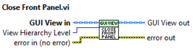

Closes the Front Panel of a specified **Actor Core.vi** VI of the specified **GUI View** class hierarchy. The method is active only if the **GUI View** is not contained. 

**View Hierarchy Level**: The level on the subclassing hierarchy of the **GUI View**, it is used to choose the **Actor Core.vi** Front Panel among all the existing subclasses of the **GUI View** present in the **View** specified above.

### The "Set Front Panel State.vi"/"Send Set Front Panel State.vi" Methods

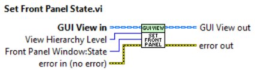
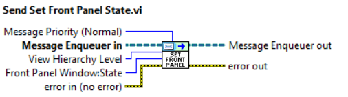

Sets the state of the Front Panel of a specified **Actor Core.vi** VI of the specified View class hierarchy. The method is active only if the GUI View is not contained.

**View Hierarchy Level**: The level on the subclassing hierarchy of the **GUI View**, it is used to choose the **Actor Core.vi** Front Panel among all the existing subclasses of the **GUI View** present in the **View** specified above.

**Front Panel Window:State**: Sets the state in which to open the front panel window.

* **0	Invalid** - If you set the input to this value, the method returns an error.
* **1	Standard (default)** - Opens the front panel window but does not minimize, maximize, or hide the window.
* **2	Closed** - If you set the input to this value, the method returns an error.
* **3	Hidden** - Opens the front panel window as floating but not visible. If you set the input to this value and close all references to the front panel, the window remains open but hidden. Because the VI is open, the Getting Started window does not appear. To solve this problem, open the VI from the operating system. For example, on Windows, double-click the VI in Windows Explorer to open the VI.
* **4	Minimized** - Opens the front panel window as minimized.
* **5	Maximized** - Opens the front panel window as maximized.

## The "GUI Container.lvclass" Class
The actor **GUI Container** is in a subclass of the **GUI View** that adds all the infrastructure required to contain GUI Views in subpanels. Once **GUI Views** are contained in a certain **GUI Container** their management is done through the methods provided by the **GUI Container**. Subpanels are defined in the **GUI Container**'s **Actor Core.vi** by explicitly storing their references in the actor by means of an appropriate method and are referenced by their label name. **GUI Views** are instead referenced by their name as of their definition in the corresponding controller. For each contained **GUI View** the **GUI Container** provides all the front panel management functionality provided by the **GUI View** plus: 
* adding and removing **GUI Views**
* inserting and removing a **GUI View** from an available subpanel
* reading the contained **GUI Views** names.

All the functionality is implemented by hiding from the user all the low-level front panel management required by LabVIEW, for example there is no need to remove a GUI View from a subpanel when inserting it in another subpanel.

### The "Store Subpanel References.vi" Method
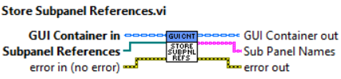

This method is used within the **Actor Core.vi** of the concrete **GUI Container** to store the references of the subpanels present in its front panel and that we want to use as containers.

**Subpanel References**: Array of subpanel refnums to be used as containers for **GUI Views**

### The "Insert View into Subpanel.vi"/"Send Insert View into Subpanel.vi" Methods

Inserts the Front Panel of a specified **Actor Core** VI of the specified **GUI View** class hierarchy into a specified subpanel

**View**: String that contains the name of the **GUI View**

**View Hierarchy Level**: The level on the subclassing hierarchy of the **GUI View**, it is used to choose the **Actor Core.vi** Front Panel  among all the existing subclasses of the **GUI VIew** specified above

**Subpanel**: string designating in which subpanel the Front Panel specified in the above terminals has to be inserted.

### The "Remove View from Subpanel.vi"/"Send Remove View from Subpanel.vi" Methods
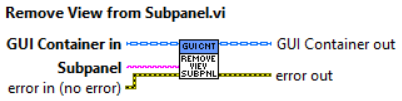

Removes the Front Panel of a specified **Actor Core.vi** VI of the specified **GUI View** class hierarchy from a specified subpanel

**Subpanel**: string designating in which subpanel the Front Panel specified in the above terminals has to be inserted.

### The "Open View FP.vi"/"Send Open View FP.vi" Methods

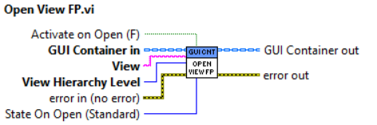

Opens the Front Panel of a specified **Actor Core.vi** VI of the specified **GUI View** class hierarchy.

**View**: String that contains the name of the View

**View Hierarchy Level**: The level on the subclassing hierarchy of the **GUI View**, it is used to choose the **Actor Core.vi** Front Panel among all the existing subclasses of the **GUI View** present in the **View** specified above.

**Activate?**: If FALSE (default), the front panel window does not open as the active window. If TRUE, the front panel window opens as the active window.

**State on Open (Standard)**: Sets the state in which to open the front panel window.

* **0	Invalid** - If you set the input to this value, the method returns an error.
* **1	Standard (default)** - Opens the front panel window but does not minimize, maximize, or hide the window.
* **2	Closed** - If you set the input to this value, the method returns an error.
* **3	Hidden** - Opens the front panel window as floating but not visible. If you set the input to this value and close all references to the front panel, the window remains open but hidden. Because the VI is open, the Getting Started window does not appear. To solve this problem, open the VI from the operating system. For example, on Windows, double-click the VI in Windows Explorer to open the VI.
* **4	Minimized** - Opens the front panel window as minimized.
* **5	Maximized** - Opens the front panel window as maximized.

### The "Close View FP.vi"/"Send Close View FP.vi" Methods

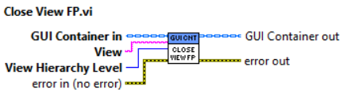

Closes the Front Panel of a specified **Actor Core.vi** VI of the specified **GUI View** class hierarchy. 

**View**: String that contains the name of the View

**View Hierarchy Level**: The level on the subclassing hierarchy of the **GUI View**, it is used to choose the **Actor Core.vi** Front Panel among all the existing subclasses of the **GUI View** present in the **View** specified above.

### The "Set View FP State.vi"/"Send Set View FP State.vi" Methods

Sets the state of the Front Panel of a specified **Actor Core.vi** VI of the the specified **GUI View** class hierarchy. 

**View**: String that contains the name of the GUI View

**View Hierarchy Level**: The level on the subclassing hierarchy of the **GUI View**, it is used to choose the **Actor Core.vi** Front Panel among all the existing subclasses of the **GUI View** present in the **View** specified above.

**Front Panel Window:State**: Sets the state in which to open the front panel window.

* **0	Invalid** - If you set the input to this value, the method returns an error.
* **1	Standard (default)** - Opens the front panel window but does not minimize, maximize, or hide the window.
* **2	Closed** - If you set the input to this value, the method returns an error.
* **3	Hidden** - Opens the front panel window as floating but not visible. If you set the input to this value and close all references to the front panel, the window remains open but hidden. Because the VI is open, the Getting Started window does not appear. To solve this problem, open the VI from the operating system. For example, on Windows, double-click the VI in Windows Explorer to open the VI.
* **4	Minimized** - Opens the front panel window as minimized.
* **5	Maximized** - Opens the front panel window as maximized.

### The "Register to Container Events.vi" Method

This method can be used in the **Actor Core.vi** of the subclass of the **GUI Container Actor**. It will register two events created by the **GUI Container Actor**, one can be used to exit the helper loop if present, and the other can be used to allow the optional event loop to receive the views contained by the "GUI Container Actor". Calling this method is optional. See the examples for an illustration of its usage.